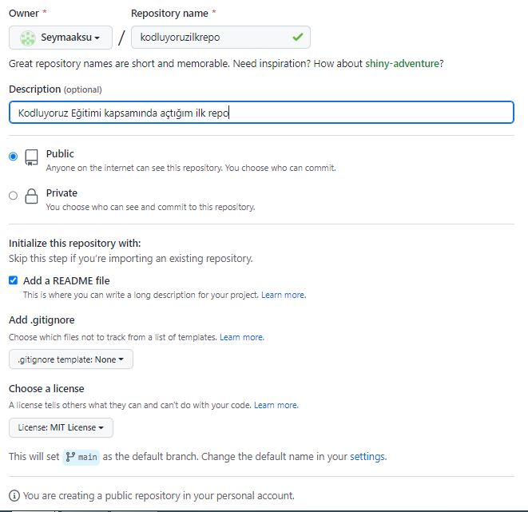

# Kodluyoruz İlk Repo
Bu repo [Kodluyoruz](https://kodluyoruz.org/tr/kodluyoruz/) Front-End Eğitiminde oluşturduğumuz ilk repo.İçerisinde bir adet README dosyası,bir adet index.html barındırıyor.


# Installation
Öncelikle projeyi clonelayın. (Buraya sizin reponuzdan aldığınız link gelecek)
```
git clone https://github.com/Seymaaksu/kodluyoruzilkrepo.git
```
# Usage

Projeyi klonladıktan sonra Visual Studio Code programında açınız

Linux için:
```
cd kodluyoruzilkrepo
code . 
```
# Contributing
Pull requestler kabul edilir.Büyük değişiklikler için, lütfen önce neyi değiştirmek istediğinizi tartışmak için bir konu açınız. [Kodluyoruz](https://kodluyoruz.org/tr/kodluyoruz/) Ekibine Teşekkürler !!! 
[PATİKA](https://www.patika.dev/tr)

